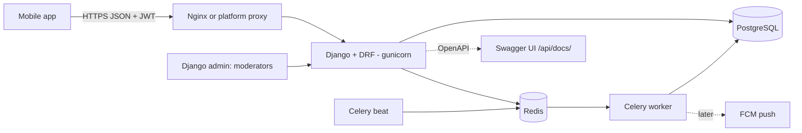
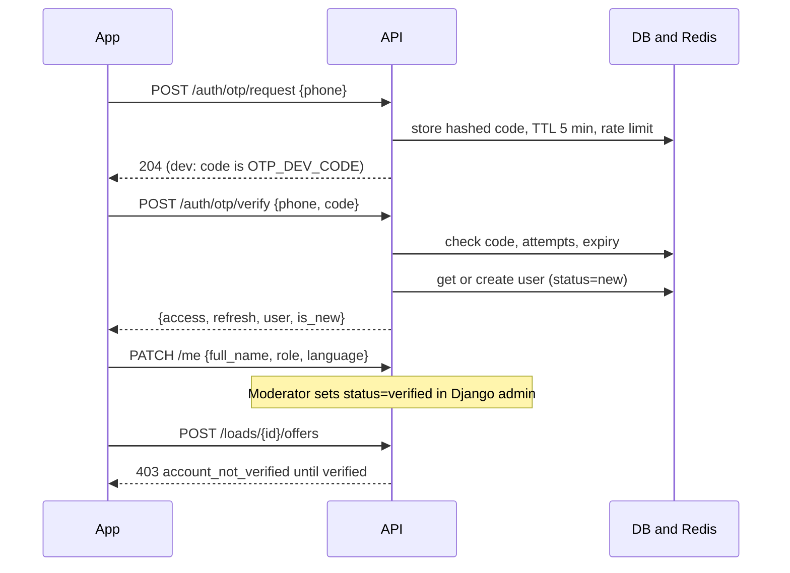
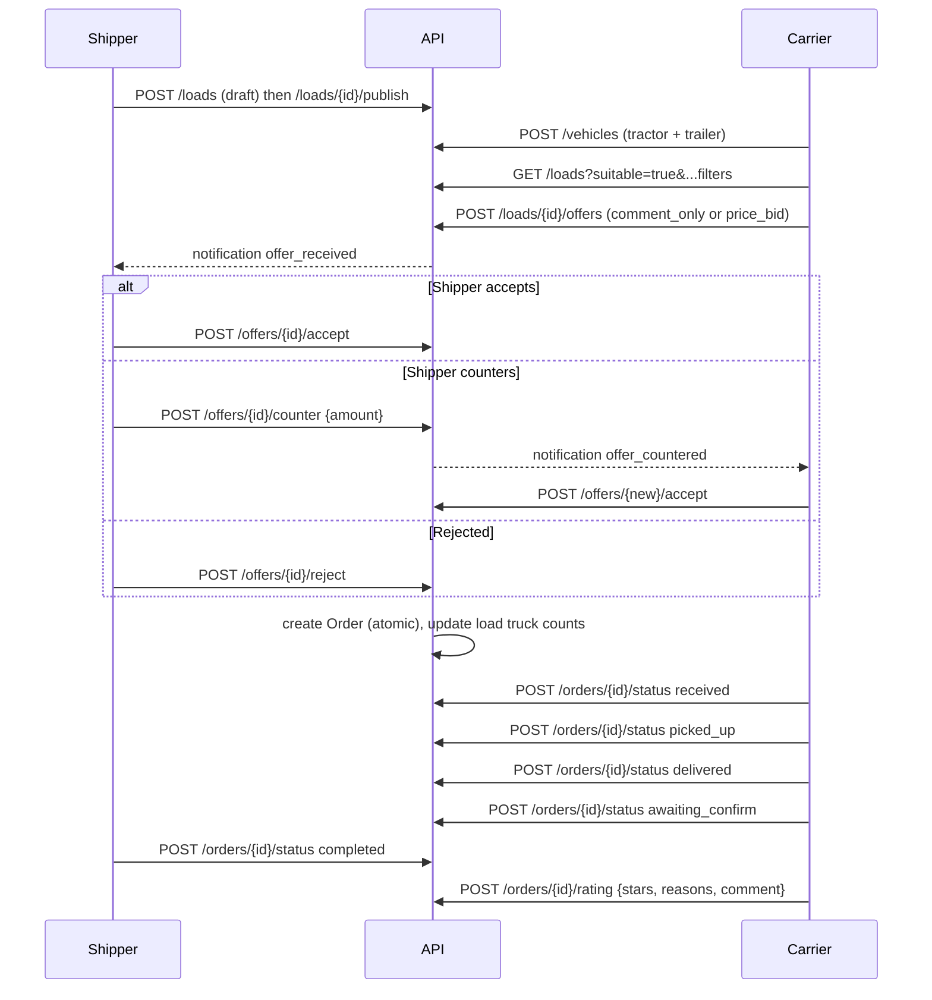
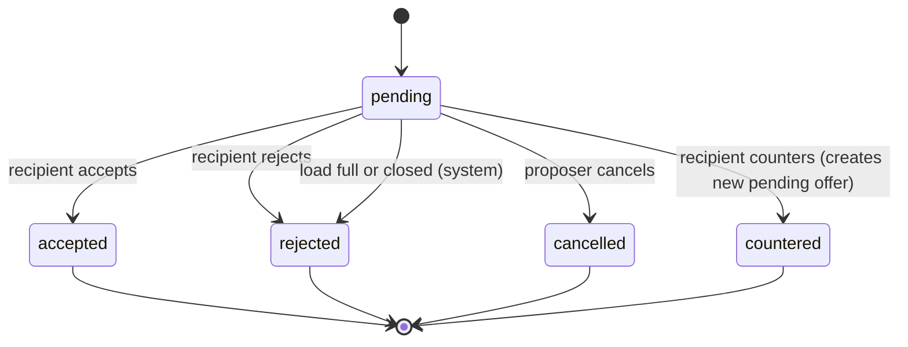
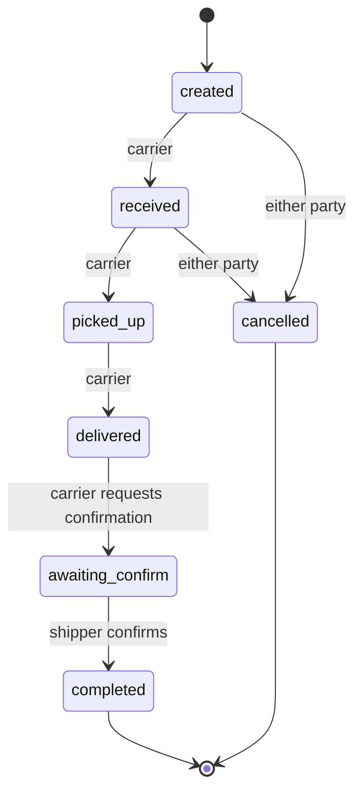
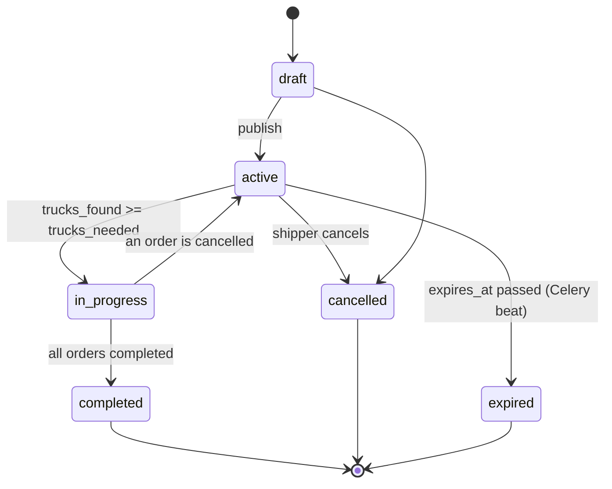
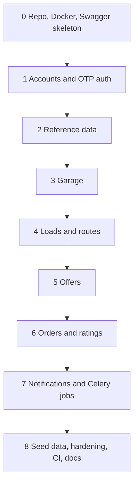
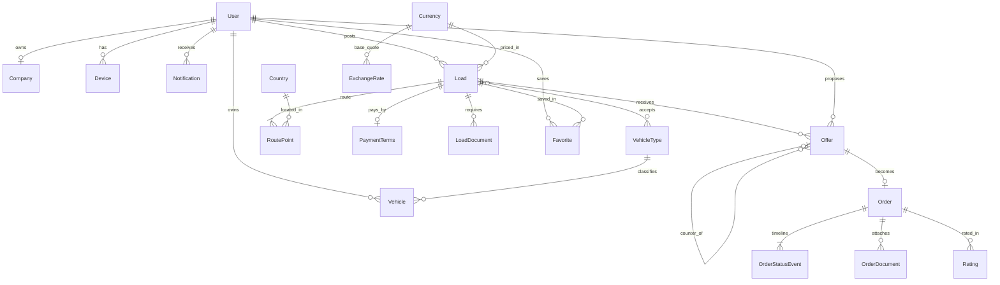

# Freight Exchange Backend: Implementation Plan

Target reader: an AI coding agent. Follow phases in order. Do not skip acceptance checks. Do not ask questions that this plan already answers.

## 0. Goal

Build the backend for a mobile freight exchange app (like a load board). Shippers post loads with multi-stop routes. Carriers keep trucks in a garage, find loads, send offers, negotiate price, and complete orders. The backend is a REST API with ready-to-use Swagger docs.

**Out of scope:** chat/messaging, live GPS tracking, payments inside the app, OCR of tech passports, real SMS provider, routing provider. Leave clean extension points, build none of them.

## 1. Tech stack

| Concern | Choice |
|---|---|
| Language | Python 3.12 |
| Framework | Django 5.x, Django REST Framework |
| API docs | drf-spectacular (Swagger UI + ReDoc + OpenAPI schema) |
| Auth | Phone + OTP, JWT via djangorestframework-simplejwt (with blacklist) |
| DB | PostgreSQL 16 |
| Cache and broker | Redis 7 |
| Background jobs | Celery + Celery Beat |
| Filtering | django-filter |
| Config | django-environ |
| Tests | pytest, pytest-django, factory_boy |
| Lint | ruff |
| Server | gunicorn (WSGI), whitenoise for static |
| Containers | Docker, docker compose |
| CI | GitHub Actions (ruff + pytest) |

Pin exact versions in `requirements/base.txt`, `requirements/dev.txt`.

## 2. Flow diagrams

### 2.1 Architecture



### 2.2 Authentication flow



### 2.3 End-to-end business flow



### 2.4 Offer state machine



### 2.5 Order state machine



### 2.6 Load lifecycle



### 2.7 Delivery phases



## 3. Repository layout

```
.
├── plan.md
├── README.md
├── Makefile
├── Dockerfile
├── docker-compose.yml
├── .env.example
├── .gitignore
├── .dockerignore
├── .github/workflows/ci.yml
├── requirements/{base,dev}.txt
├── manage.py
├── config/
│   ├── settings/{base,dev,prod}.py
│   ├── urls.py
│   ├── celery.py
│   └── wsgi.py
└── apps/
    ├── core/          # BaseModel (created_at, updated_at), pagination, permissions, exceptions, utils
    ├── accounts/      # User, Company, OTP, Device, auth views
    ├── geo/           # Country, Currency, ExchangeRate
    ├── garage/        # VehicleType, Vehicle
    ├── loads/         # Load, RoutePoint, PaymentTerms, LoadDocument, Favorite
    ├── offers/        # Offer
    ├── orders/        # Order, OrderStatusEvent, OrderDocument, Rating
    └── notifications/ # Notification
```

Each app: `models.py`, `serializers.py`, `views.py`, `urls.py`, `services.py` (business logic, all state changes), `filters.py` where needed, `admin.py`, `tests/`. Views stay thin and call `services.py`. All multi-row state changes run inside `transaction.atomic()`.

## 4. Data model

Primary keys are `BigAutoField`. Every table has `created_at`, `updated_at` (from `core.BaseModel`) unless noted. Money: `DecimalField(max_digits=18, decimal_places=2)`, never float. Timestamps are timezone-aware, store UTC.



### accounts
- **User** (custom, `AUTH_USER_MODEL = "accounts.User"`, create BEFORE the first migration): `phone` (unique, E.164, USERNAME_FIELD), `full_name`, `role` (`carrier|shipper|both`, default `carrier`), `language` (`uz|ru|en`, default `ru`), `status` (`new|pending_review|verified|blocked`, default `new`), `avatar` (ImageField, null), `is_active`, `is_staff`. No username, no password required (`set_unusable_password`).
- **Company**: `owner` (OneToOne User), `name`, `tin` (unique, null), `address`, `rating_avg` (Decimal 3,2, default 0), `rating_count` (int, default 0), `verified_at` (null).
- **Device**: `user` FK, `fcm_token` (unique), `platform` (`ios|android`), `last_seen_at`.
- **OtpCode**: `phone`, `code_hash`, `attempts` (int), `expires_at`, `used_at` (null). Index on `(phone, created_at)`.

### geo
- **Country**: `code` (PK, char(2), ISO), `name_i18n` (JSON `{uz,ru,en}`), `flag_url`.
- **Currency**: `code` (PK, char(3): UZS, USD, EUR, RUB, KZT, AED), `name`.
- **ExchangeRate**: `base` FK, `quote` FK, `rate` Decimal(18,6), `fetched_at`. Unique `(base, quote, fetched_at)`. Manual or admin-managed in MVP.

### garage
- **VehicleType**: `code` (unique), `name_i18n` JSON, `image_url`, `kind` (`tractor|trailer`). Seed all body types seen in the design: tent, board, van, reefer, tanker, container, low-loader, isothermal, open container, oversize, low-bed platform, telescopic, timber-by-pallet, ... (fixture file `apps/garage/fixtures/vehicle_types.json`, loaded by seed command).
- **Vehicle**: `owner` FK, `kind` (`tractor|trailer`), `vehicle_type` FK (null), `plate_number` (unique, normalized uppercase no spaces), `tech_passport_no`, `owner_full_name`, `brand`, `tech_passport_image` (ImageField, null), `paired_vehicle` (FK self, null, `SET_NULL`), `is_active` (default True). Validation: `paired_vehicle` must have the opposite `kind` and the same `owner`.

### loads
- **Load**: `shipper` FK User, `company` FK (null), `cargo_description`, `cargo_type`, `weight_t` Decimal(10,3), `volume_m3` Decimal(10,3, null), `length_m` Decimal(8,2, null), `packaging`, `transport_mode` (`FTL|LTL`, default FTL), `vehicle_category`, `body_types` M2M VehicleType, `trucks_needed` (int ≥1, default 1), `trucks_found` (int, default 0), `is_adr` (bool), `adr_class` (smallint, null), `temp_controlled` (bool), `temp_min_c`/`temp_max_c` (Decimal, null), `price_amount` Decimal (null), `currency` FK (null), `vat_included` (bool), `price_negotiable` (bool, default True), `distance_km` (int, null), `status` (`draft|active|in_progress|completed|cancelled|expired`), `published_at`, `expires_at`.
  Indexes: `(status, published_at DESC)`, `(shipper)`, `(currency)`. Validate: `adr_class` required if `is_adr`; temps required if `temp_controlled`; `price_amount` requires `currency`.
- **RoutePoint**: `load` FK, `seq` (smallint), `kind` (`loading|stop|transit|border|customs|unloading`), `country` FK, `address`, `lat`/`lng` Decimal(9,6), `planned_from`, `planned_to` (null), `asap` (bool), `ready_to_load` (bool), `comment`. Unique `(load, seq)`. A load needs ≥1 `loading` first (lowest seq) and ≥1 `unloading` last (highest seq). The API accepts the full ordered list nested in the load payload and replaces it on update.
- **PaymentTerms** (OneToOne Load, PK = load): `prepay_amount`, `prepay_method` (`cash|transfer`), `paid_amount`, `paid_method`, `remaining_amount`, `payment_due_days`, `conditions`.
- **LoadDocument**: `load` FK, `name`, `file` (FileField, null).
- **Favorite**: `user` FK, `load` FK, unique `(user, load)`.

### offers
- **Offer**: `load` FK, `carrier` FK User (the carrier party of this negotiation), `proposer` FK User (who created this row), `recipient` FK User (who must answer), `vehicle` FK (tractor, null), `trailer` FK (null), `parent` FK self (null, set on counter-offer), `mode` (`comment_only|price_bid`), `amount` Decimal (null; required if `price_bid`), `currency` FK (null), `comment`, `status` (`pending|accepted|rejected|cancelled|countered`), `responded_at`.
  Constraints: partial unique `(load, carrier)` where `status='pending'` (one open negotiation per carrier per load). `proposer != recipient`.

### orders
- **Order**: `offer` OneToOne (the accepted one), `load` FK, `shipper` FK, `carrier` FK, `vehicle` FK (null), `trailer` FK (null), `agreed_amount` (null), `currency` FK (null), `status` (see state machine), `cancel_reason`, `completed_at`.
- **OrderStatusEvent**: `order` FK, `status`, `actor` FK, `note`, `at` (auto_now_add). Written on every transition, including creation.
- **OrderDocument**: `order` FK, `name`, `file`, `size_kb`, `uploaded_by` FK.
- **Rating**: `order` FK, `rater` FK, `ratee` FK, `stars` (1–5), `reasons` (ArrayField of str), `comment`. Unique `(order, rater)`. After save, recompute `Company.rating_avg` and `rating_count` for the ratee's company in the same transaction.

### notifications
- **Notification**: `user` FK, `type` (`offer_received|offer_accepted|offer_rejected|offer_countered|order_status|account_verified`), `payload` JSON, `read_at` (null). Index `(user, read_at, created_at DESC)`.

## 5. Business rules (implement in `services.py`)

1. **Verification gate.** Only users with `status=verified` may create offers, create loads, and change order status. Others get `403` with `code: "account_not_verified"`. Browsing loads is allowed for any authenticated user.
2. **Role gate.** Posting loads needs role `shipper|both`. Creating offers needs `carrier|both`.
3. **Create offer.** Load must be `active`. Carrier cannot offer on own load. If `mode=price_bid`, `amount` and `currency` are required. If `price_negotiable=false` and the load has a price, a `price_bid` is rejected (`400`); only `comment_only` is allowed. Duplicate pending offer returns `409`. Sets `proposer=carrier`, `recipient=load.shipper`. Creates a notification for the recipient.
4. **Accept offer** (only the recipient, only if `pending`), in one `transaction.atomic()` with `select_for_update()` on the load and the offer:
   - Offer `status=accepted`, `responded_at=now`.
   - Create the `Order` (copy parties, vehicle, trailer, amount, currency) with an `OrderStatusEvent(created)`.
   - Load `trucks_found += 1`. If `trucks_found >= trucks_needed`: load `status=in_progress` and all other `pending` offers on the load become `rejected` (notify those carriers).
   - Notify the proposer.
5. **Reject offer.** Recipient only. Status `rejected`. Notify proposer.
6. **Cancel offer.** Proposer only, if `pending`.
7. **Counter offer.** Recipient only, if `pending`. Mark the old offer `countered`; create a new `pending` offer with `parent=old`, `proposer=old.recipient`, `recipient=old.proposer`, new `amount`/`currency`/`comment`. Same `carrier`. Notify.
8. **Order status transitions** follow section 2.5. `received`, `picked_up`, `delivered`, `awaiting_confirm` are carrier-only; `completed` is shipper-only; `cancelled` is either party and only from `created|received` (`cancel_reason` required). Invalid transition returns `409` with `code: "invalid_transition"`. Every transition writes an `OrderStatusEvent` and a notification to the other party. On `cancelled`: `load.trucks_found -= 1`; if the load was `in_progress` set it back to `active`. When the last order of a load reaches `completed` and `trucks_found == trucks_needed`, load becomes `completed`.
9. **Rating.** Only for `completed` orders, only by a party of the order, once per rater (`409` otherwise). `ratee` is the other party.
10. **Deals lists.** `direction=outgoing` means `proposer = me`. `direction=incoming` means `recipient = me`.
11. **Suitable loads** (`?suitable=true`). The load's `body_types` intersect the body types of my active vehicles' `vehicle_type` (a load with no body types matches everything).
12. **Sorting.** `ordering` accepts `-published_at` (default), `distance_km`, `-price_amount`, and `price_per_km` (annotate `price_amount / NULLIF(distance_km, 0)`).
13. **Distance.** MVP: if the client sends `distance_km`, store it; else compute the sum of haversine distances between consecutive route points. Put it behind `loads/services.py::compute_distance_km` so a routing API can replace it later.
14. **Expiry.** Celery beat task every 10 minutes: loads with `status=active` and `expires_at < now` become `expired`; their pending offers become `rejected`.
15. **OTP.** Code is 6 digits, stored hashed, TTL 5 minutes, max 5 attempts, max 3 requests per phone per 10 minutes (Redis counter). SMS sending goes through `accounts/sms.py::send_sms(phone, text)`, with a `ConsoleSmsBackend` selected by `SMS_BACKEND`. In dev, when `OTP_DEV_CODE` is set, that code is always accepted so Swagger testing works without SMS. `OTP_DEV_CODE` must be empty in prod settings.

## 6. API specification

Base path: `/api/v1/`. JSON. Auth header: `Authorization: Bearer <access>`. Pagination: page number, `page_size` 20 (max 100), response `{count, next, previous, results}`. Errors: `{"detail": "...", "code": "..."}` via a custom exception handler.

### Auth and profile
| Method | Path | Notes |
|---|---|---|
| POST | `/auth/otp/request` | `{phone}` → 204 |
| POST | `/auth/otp/verify` | `{phone, code}` → `{access, refresh, is_new, user}` |
| POST | `/auth/token/refresh` | simplejwt |
| POST | `/auth/logout` | blacklist refresh |
| GET, PATCH | `/me` | profile; multipart for avatar |
| PUT | `/me/company` | create or update the company |
| POST | `/me/devices` | register FCM token |
| DELETE | `/me/devices/{token}` | |

### Reference
| Method | Path |
|---|---|
| GET | `/countries` |
| GET | `/currencies` |
| GET | `/vehicle-types?kind=` |
| GET | `/exchange-rates` |

### Garage
| Method | Path | Notes |
|---|---|---|
| GET, POST | `/vehicles` | `?kind=tractor|trailer`; only mine |
| GET, PATCH, DELETE | `/vehicles/{id}` | soft delete via `is_active=false` |

### Loads
| Method | Path | Notes |
|---|---|---|
| GET | `/loads` | filters below |
| POST | `/loads` | creates a draft with nested `route_points`, `payment_terms`, `body_types` (ids) |
| GET | `/loads/{id}` | full detail, includes `route_points`, `payment_terms`, `documents`, `is_favorite`, `my_offer` |
| PATCH | `/loads/{id}` | owner only, only when `draft|active` |
| POST | `/loads/{id}/publish` | draft → active, sets `published_at`, default `expires_at` = +7 days |
| POST | `/loads/{id}/cancel` | |
| GET | `/loads/mine` | shipper's own loads, any status |
| POST, DELETE | `/loads/{id}/favorite` | |
| GET | `/me/favorites` | |
| GET | `/loads/map` | `?bbox=minLng,minLat,maxLng,maxLat` → light items `{id, lat, lng, price_amount, currency}` using the first loading point |

Load list filters (`django-filter`): `origin_country`, `destination_country`, `body_types` (multi), `weight_min`, `weight_max`, `volume_min`, `volume_max`, `price_min`, `price_max`, `currency`, `loading_from`, `loading_to`, `unloading_from`, `unloading_to`, `is_adr`, `temp_controlled`, `has_offers`, `transport_mode`, `suitable`, `search`, `ordering`. List items are compact: id, origin and destination city/country, distance, weight, body types, price, currency, shipper company name, `published_at`, `negotiable`. The list response includes `count` (the UI shows "Все · 1571").

### Offers
| Method | Path | Notes |
|---|---|---|
| POST | `/loads/{id}/offers` | create |
| GET | `/offers` | `?direction=outgoing|incoming&status=` |
| GET | `/offers/{id}` | |
| POST | `/offers/{id}/accept` | |
| POST | `/offers/{id}/reject` | |
| POST | `/offers/{id}/cancel` | |
| POST | `/offers/{id}/counter` | `{amount, currency, comment}` |

### Orders
| Method | Path | Notes |
|---|---|---|
| GET | `/orders` | `?tab=active|history` (active = not completed/cancelled) |
| GET | `/orders/{id}` | includes `load` summary, `route_points`, `status_events`, `documents` |
| POST | `/orders/{id}/status` | `{status, note?}` |
| POST | `/orders/{id}/documents` | multipart |
| POST | `/orders/{id}/rating` | `{stars, reasons[], comment}` |

### Notifications
| Method | Path |
|---|---|
| GET | `/notifications` (includes `unread_count` in a header or field) |
| POST | `/notifications/{id}/read` |
| POST | `/notifications/read-all` |

### Service
| Path | Notes |
|---|---|
| `/health/` | 200 JSON, checks DB |
| `/admin/` | Django admin |
| `/api/schema/` | OpenAPI JSON |
| `/api/docs/` | Swagger UI |
| `/api/redoc/` | ReDoc |

## 7. Swagger requirements (must work out of the box)

Use drf-spectacular.

```python
# config/settings/base.py (excerpt)
REST_FRAMEWORK = {
    "DEFAULT_SCHEMA_CLASS": "drf_spectacular.openapi.AutoSchema",
    "DEFAULT_AUTHENTICATION_CLASSES": ["rest_framework_simplejwt.authentication.JWTAuthentication"],
    "DEFAULT_PERMISSION_CLASSES": ["rest_framework.permissions.IsAuthenticated"],
    "DEFAULT_PAGINATION_CLASS": "apps.core.pagination.DefaultPagination",
    "DEFAULT_FILTER_BACKENDS": ["django_filters.rest_framework.DjangoFilterBackend",
                                "rest_framework.filters.OrderingFilter",
                                "rest_framework.filters.SearchFilter"],
    "EXCEPTION_HANDLER": "apps.core.exceptions.handler",
}
SPECTACULAR_SETTINGS = {
    "TITLE": "Freight Exchange API",
    "DESCRIPTION": "Carrier and shipper marketplace. In dev use phone +998900000001 and code 000000.",
    "VERSION": "1.0.0",
    "SERVE_INCLUDE_SCHEMA": False,
    "COMPONENT_SPLIT_REQUEST": True,   # needed for file upload fields
    "SWAGGER_UI_SETTINGS": {"persistAuthorization": True, "displayRequestDuration": True},
    "SECURITY": [{"bearerAuth": []}],
    "APPEND_COMPONENTS": {"securitySchemes": {"bearerAuth": {"type": "http", "scheme": "bearer", "bearerFormat": "JWT"}}},
}
```

Rules for a usable Swagger:
- Every view has `@extend_schema` with `tags` (Auth, Profile, Reference, Garage, Loads, Offers, Orders, Notifications), a summary, and request/response serializers. Action endpoints (`accept`, `publish`, ...) declare their request body and responses explicitly.
- Document 400/401/403/404/409 responses with the shared error serializer.
- Examples: `OpenApiExample` for OTP request, OTP verify, create load (with a 3-point route), create offer, counter, order status.
- The "Authorize" button works with a pasted access token. `persistAuthorization` keeps it across reloads.
- `/api/docs/` is public in dev and prod (`permission_classes=[AllowAny]` on the schema views); the API calls themselves still need a token.
- Acceptance test (automated): `python manage.py spectacular --validate --fail-on-warn` exits 0, and a test fetches `/api/schema/` and `/api/docs/` expecting 200.

**Quick test script for the README** (also put in a pytest e2e test):
1. `POST /auth/otp/request` with `{"phone": "+998900000001"}`.
2. `POST /auth/otp/verify` with `{"phone": "+998900000001", "code": "000000"}`; copy `access`.
3. Click Authorize, paste the token.
4. `GET /loads` returns seeded loads. Seeded user `+998900000001` is a verified carrier with a tractor and trailer. `+998900000002` is a verified shipper who owns the seeded loads.

## 8. Docker

`Dockerfile`: multi-stage, `python:3.12-slim`, install deps in a builder stage, run as non-root user, `PYTHONDONTWRITEBYTECODE=1`, `PYTHONUNBUFFERED=1`. Default command: gunicorn.

`docker-compose.yml` services:
- `db`: `postgres:16-alpine`, named volume, healthcheck `pg_isready`.
- `redis`: `redis:7-alpine`, healthcheck `redis-cli ping`.
- `web`: builds the image, `depends_on` db and redis with `condition: service_healthy`. Entrypoint script waits for the DB, runs `migrate`, runs `collectstatic --noinput`, then starts gunicorn on `0.0.0.0:8000`. Ports `8000:8000`. Volume for `media/`. In dev, compose override mounts the source and runs `runserver`.
- `worker`: `celery -A config worker -l info`.
- `beat`: `celery -A config beat -l info`.

Files: `docker-compose.yml` (base), `docker-compose.override.yml` (dev, bind mount and runserver), `.env.example` (committed), `.env` (git-ignored).

`.env.example` keys: `DJANGO_SETTINGS_MODULE`, `SECRET_KEY`, `DEBUG`, `ALLOWED_HOSTS`, `DATABASE_URL`, `REDIS_URL`, `CORS_ALLOWED_ORIGINS`, `JWT_ACCESS_MINUTES`, `JWT_REFRESH_DAYS`, `SMS_BACKEND`, `OTP_DEV_CODE`, `POSTGRES_DB`, `POSTGRES_USER`, `POSTGRES_PASSWORD`. Use obviously fake values only.

`Makefile` targets: `up`, `down`, `logs`, `migrate`, `makemigrations`, `seed`, `test`, `lint`, `shell`, `schema`.

Acceptance: from a clean clone, `cp .env.example .env && docker compose up --build` gives a running API with `http://localhost:8000/api/docs/` showing Swagger, and `make seed` loads demo data.

## 9. Phases

Commit at the end of each phase (Conventional Commits, e.g. `feat(accounts): phone OTP auth`) and push. Keep the tree green: `ruff check .` and `pytest` pass before each commit.

### Phase 0: Repo, skeleton, Docker, Swagger
1. Create the project in an empty directory: Django project `config`, apps under `apps/`, requirements files, Dockerfile, compose files, `.env.example`, `.gitignore` (include `.env`, `__pycache__`, `media/`, `staticfiles/`, `*.sqlite3`, `.venv`), `.dockerignore`, `Makefile`, README with the quick start.
2. Configure settings (base/dev/prod), DRF, spectacular, simplejwt, CORS, whitenoise, Celery, `/health/`.
3. **Create the private GitHub repository and push** (prerequisite: `gh auth status` succeeds; if not, stop and ask the user to run `gh auth login`):
   ```bash
   git init -b main
   git add -A
   git commit -m "chore: project skeleton"
   gh repo create freight-exchange-backend --private --source=. --remote=origin --push
   gh repo view --json visibility,url   # visibility must be "PRIVATE"
   ```
   Confirm `.env` is NOT tracked: `git ls-files | grep -c '^.env$'` prints `0`. If the repo name is taken, append a suffix and report the final URL. Never make the repo public.
4. Add `.github/workflows/ci.yml`: on push and PR, Postgres service, install `requirements/dev.txt`, `ruff check .`, `python manage.py spectacular --validate --fail-on-warn`, `pytest`.

**Accept:** `docker compose up --build` works; `/health/` returns 200; `/api/docs/` loads; repo is private on GitHub with the first commit pushed; CI file present.

### Phase 1: Accounts and OTP auth
Models: User (custom manager `create_user(phone)`), Company, Device, OtpCode. Services: `request_otp`, `verify_otp`. Endpoints from section 6 (Auth and profile). Admin: User list with status filter and a bulk action "Mark verified" that also creates an `account_verified` notification. Permissions: `IsVerified`, `HasRole`.
**Accept:** tests cover OTP happy path, wrong code, expired code, attempts limit, request rate limit, refresh, logout/blacklist, PATCH `/me`. Swagger flow in section 7 works.

### Phase 2: Reference data
Country, Currency, ExchangeRate models, fixtures (Uzbekistan, Russia, Kazakhstan, Kyrgyzstan, Tajikistan, Turkmenistan, Turkey, United Kingdom, China, plus others; currencies UZS, USD, EUR, RUB, KZT, AED), read-only list endpoints, cached for 1 hour.
**Accept:** endpoints return seeded data; tests pass.

### Phase 3: Garage
VehicleType (with fixture of all body types), Vehicle, endpoints, owner-scoping, pairing validation.
**Accept:** a user sees only their own vehicles; duplicate plate returns 400; pairing wrong kinds returns 400; tests pass.

### Phase 4: Loads and routes
Models, nested writable serializer for create/update (route points, payment terms, body types), publish/cancel, favorites, filters (all from section 6), `suitable`, ordering incl. `price_per_km`, map endpoint, distance computation, query optimization (`select_related`, `prefetch_related`; assert query count in a test for the list endpoint).
**Accept:** create a load with 3 route points; route validation rules enforced; every filter has a test; list uses a constant number of queries regardless of page size.

### Phase 5: Offers
Model, constraints, services for create/accept/reject/cancel/counter, endpoints, deals lists. Concurrency test: two simultaneous accepts on a 1-truck load produce exactly one order (use `transaction=True` pytest mark and threads, or at minimum assert the second accept returns 409).
**Accept:** all rules in section 5 (1–7, 10) have tests, including counter-offer chains and auto-reject of other pending offers when the load fills.

### Phase 6: Orders and ratings
Order, events, documents, rating; status service with the role matrix; cancel rules; load status sync; company rating recompute.
**Accept:** full happy path test from offer accept to completed to rating; invalid transitions return 409; wrong-role transitions return 403.

### Phase 7: Notifications and Celery
Notification model and endpoints; helper `notify(user, type, payload)` used by services; Celery tasks: `expire_loads` (beat, every 10 min), `send_push` (stub that logs; wired for FCM later). Services call `transaction.on_commit` before dispatching tasks.
**Accept:** each notification trigger in section 5 has a test; `expire_loads` has a test.

### Phase 8: Seed, hardening, docs
1. `python manage.py seed_demo`: idempotent; creates the two demo users (carrier `+998900000001`, shipper `+998900000002`, both verified, with companies), a tractor and trailer for the carrier, ~30 loads from the shipper with varied routes (including a 5-point route with border and customs), payment terms, documents, 3 offers in different states, 1 order in each major status, 1 rating.
2. Throttling (`AnonRateThrottle` 60/min, `UserRateThrottle` 600/min, stricter on OTP request).
3. Security: `SECURE_*` settings in prod, `DEBUG=False` default in prod, `ALLOWED_HOSTS` from env, file upload size and type limits (images 5 MB, documents 10 MB), no secrets in repo.
4. Django admin for every model, with useful `list_display`, `list_filter`, `search_fields`.
5. README: quick start, Swagger test script from section 7, env var table, architecture diagram, phase status.
6. Final check: clean-clone run (`git clone`, `cp .env.example .env`, `docker compose up --build`, `make seed`), then exercise the Swagger script once. Push. Tag `v0.1.0`.

**Accept:** everything in section 10.

## 10. Definition of done

- [ ] Private GitHub repo exists, `main` pushed, CI green, `.env` not tracked.
- [ ] `docker compose up --build` gives working API, Redis, worker, beat, Postgres on a clean machine.
- [ ] `http://localhost:8000/api/docs/` shows Swagger UI with all endpoints grouped by tag, examples filled, Authorize works.
- [ ] `spectacular --validate --fail-on-warn` passes.
- [ ] `make seed` gives a demo dataset; the Swagger script in section 7 works with no SMS provider.
- [ ] `pytest` passes; business rules in section 5 each covered by at least one test.
- [ ] `ruff check .` clean.
- [ ] README documents setup, test accounts, and env vars.

## 11. Conventions for the agent

- Business logic only in `services.py`, never in views or serializers. Views validate, call a service, serialize.
- Use `select_for_update()` inside `transaction.atomic()` for accept, counter, order status, and truck count changes.
- Never use float for money. Never store raw OTP codes. Never commit secrets.
- Add a migration per model change; do not edit applied migrations.
- Write tests with factory_boy factories in `apps/<app>/tests/factories.py`; one test file per service or view group.
- If a requirement here is ambiguous, pick the simplest option that satisfies the acceptance check, note it in `README.md` under "Decisions", and continue.
- Schema differences from the earlier ER diagram (intentional): `offers` gains `proposer`, `recipient`, `carrier` instead of `created_by`; chat tables and `tracking_points` are dropped; `otp_codes` gains `used_at`.
